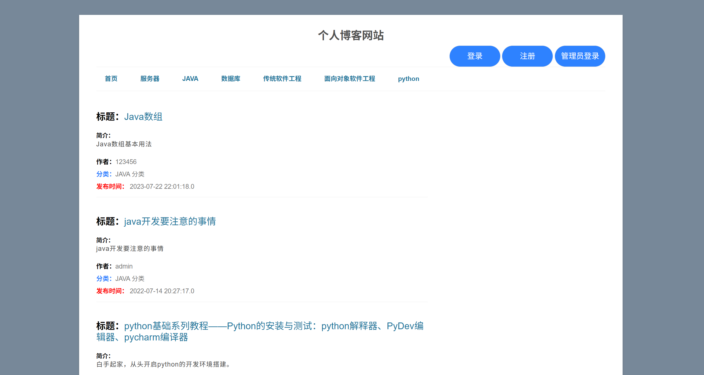
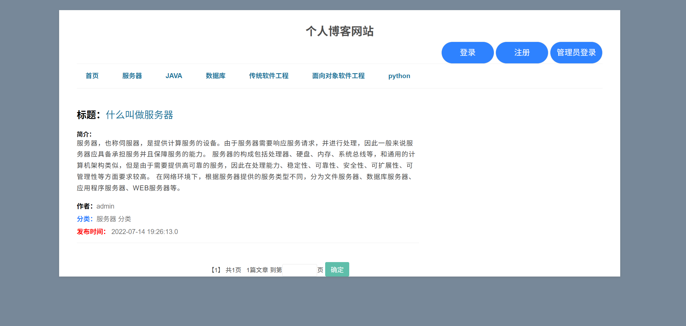
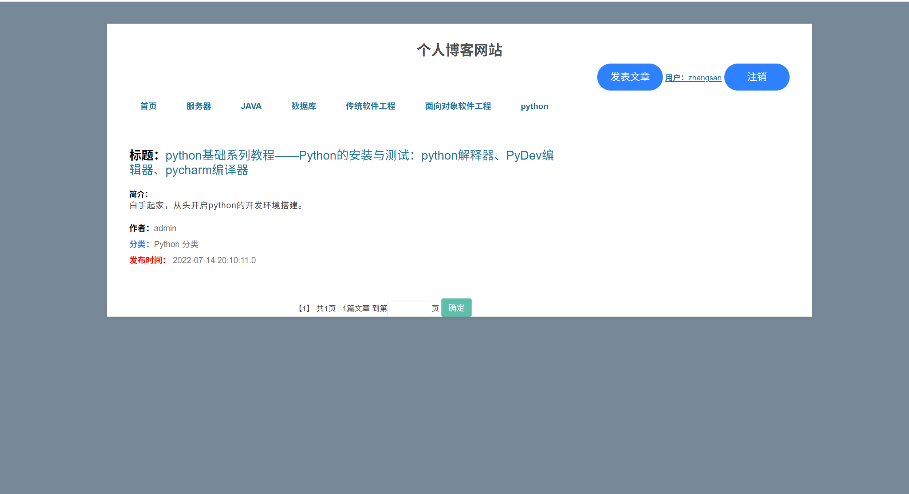
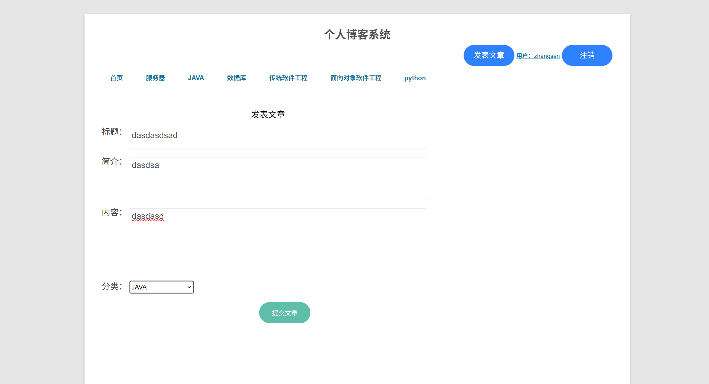
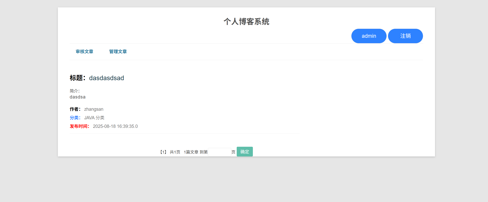
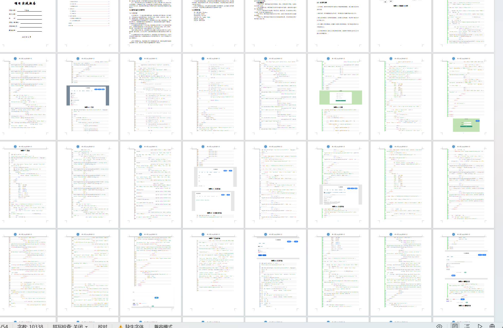

# jspServlet006
jspServlet006个人博客系统
 
## 查看主页获取源码

### 一、关键词
个人博客系统，博客系统

### 二、作品包含
源码+数据库+设计报告文档+全套环境和工具资源+本地部署教程

### 三、项目技术
前端技术：Html、Css、Js、Jquery、Bootstrap
后端技术：Java、JSP、Servlet、JDBC

### 四、运行环境（以下版本亲测，其他版本兼容性请自行测试）
开发工具：IDEA/eclipse

数据库：MySQL5.7或8.0

服务器：Tomcat8.5或Tomcat9.0

数据库管理工具：Navicat10以上版本

环境配置软件： JDK1.8

浏览器：谷歌浏览器

### 五、项目介绍
项目编号：jspServlet006

设计和开发一个功能完善的博客系统：目标是通过研究和实践，设计和开发一个具备基本功能的博客系统，包括用户注册、登录、文章发布、评论、分类、标签等功能，以满足用户的基本功能需求。

系统分为两个角色：普通用户、管理员. 普通用户：登录注册、发布博客、发表评论、查看自己发布的博客、查看其他人发布的博客. 管理员：审核用户发布的博客、管理所有博客(删除博客、删除评论)

### 六、运行截图

